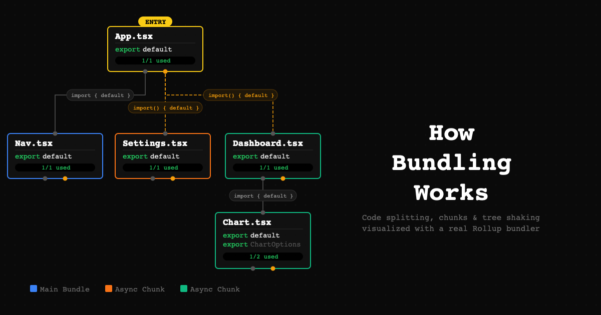

# How Bundling Works

An interactive visualization tool that demonstrates how JavaScript bundlers work. Build a module graph, run a real Rollup bundler in the browser, and see code splitting, chunks, and tree shaking in action.



## Features

- **Visual module graph editor** - Add modules, define exports, and connect them with static or dynamic imports
- **Real bundling** - Uses Rollup (via `@rollup/browser`) to bundle your module graph directly in the browser
- **Code splitting visualization** - See how dynamic imports create separate async chunks, color-coded on the graph
- **Tree shaking** - Observe which exports are used vs. unused after bundling
- **Interactive layout** - Drag nodes, edit filenames and exports inline, with auto-layout powered by ELK
- **Preset examples** - Load example graphs demonstrating common bundling patterns

## Tech Stack

- React + TypeScript
- [ReactFlow](https://reactflow.dev/) for the graph editor
- [Rollup (browser build)](https://rollupjs.org/) for in-browser bundling
- [ELK.js](https://github.com/kieler/elkjs) for automatic graph layout
- [Zustand](https://github.com/pmndrs/zustand) for state management
- [Tailwind CSS](https://tailwindcss.com/) for styling
- Vite for development and builds

## Getting Started

```bash
pnpm install
pnpm dev
```

## Building

```bash
pnpm build
pnpm preview
```

## License

MIT
